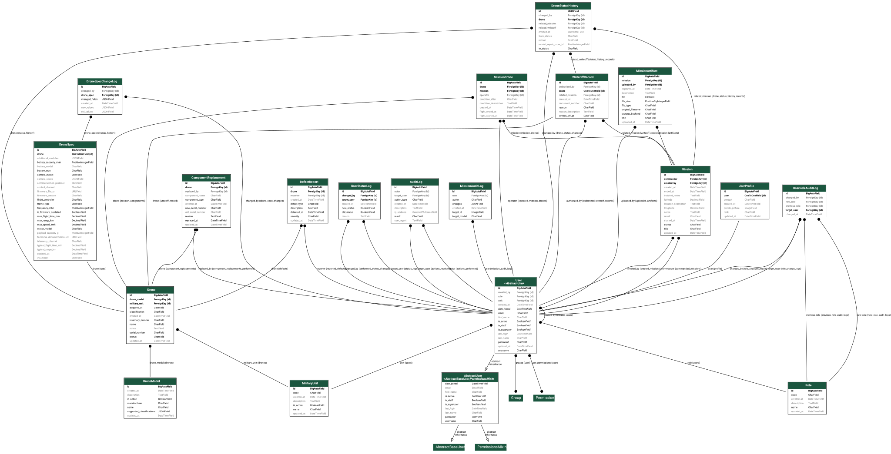

## Overview

The FPV Drone Fleet Management System provides centralized control over drone inventory, technical specifications, mission usage, maintenance processes, and write-off procedures. The platform supports secure storage and management of mission-related video data using external storage solutions.

### Key Objectives:
- Centralized drone inventory management
- Technical specifications and configurations tracking
- Combat mission recording and monitoring
- Maintenance and repair lifecycle management
- Controlled drone decommissioning (write-off process)
- Secure mission video data storage and retrieval
- Role-based access control (RBAC)
- Scalable, API-first architecture

## Technology Stack

### Backend
- **Python** - Core programming language
- **Django** - Web framework
- **Django REST Framework** - RESTful API development
- **PostgreSQL** - Primary database

### Frontend
- **Django Templates** - Responsive UI

### Storage
- **PostgreSQL** - Structured data storage
- **External Storage** for video files:
  - AWS S3 / Azure Blob / Google Cloud Storage
  - MinIO (S3-compatible)
  - Remote file server

### Infrastructure
- **Docker** - Containerized deployment
- **Gunicorn** - Python WSGI HTTP server
- **Redis + Celery** - Background task processing
- **Nginx** - Web server and reverse proxy

## System Architecture

The system follows a modular monolithic architecture with clear separation of concerns:

```
Mission-Control-System/
├── accounts/          # User and role management, RBAC implementation
├── common/            # Shared functionality
├── drones/            # Drone inventory
├── media/             # Video file handling
├── missions/          # Mission tracking
├── repairs/           # Maintenance management
├── roles/             # Role definitions
└── config/            # Project configuration
```

This modular structure enables future evolution into microservices architecture if needed.

## Core Modules

### 1. Drone Inventory Management
- Create and manage drone records
- Store identification and classification data
- Track drone status (active, in mission, damaged, under repair, written off)
- Advanced filtering and search capabilities

#### 1.1 Technical Specifications Management
- Hardware configuration tracking (frame, motors, battery, camera)
- Performance metrics (speed, range, flight time)
- Firmware and communication parameters

#### 1.2 Write-Off Management
- Record drone decommissioning events
- Document write-off reasons (loss, destruction, critical damage)
- Preserve historical data for auditing

### 2. Mission Management Module
- Register and track missions
- Assign drones and operators
- Record mission details (location, duration, result)
- Link mission outcomes to drone condition
- Attach mission video data

### 3. Maintenance & Repair Module
- Register defects and issues
- Track repair status and actions
- Record replaced components
- Maintain comprehensive repair history

### 4. Mission Artifacts Storage Module
- Upload mission artifact files to external storage
- Store and manage artifact metadata
- Link artifacts to missions and drones
- Secure, role-based access control
- Audit file actions in `MediaAuditLog` (upload, view, download, delete, denied)
- Purge audit entries past `MEDIA_AUDIT_LOG_RETENTION_DAYS` via the `purge_audit_logs` command / daily Celery task

### 5. Administration & User Management
- User registration and management
- Role assignment and access control
- Account activation/deactivation
- Comprehensive audit logging

## Security Features

- Basic or session-based authentication
- Role-based access control (RBAC)
- Secure file upload with validation
- Comprehensive audit logging
- CSRF protection
- SQL injection prevention
- XSS protection

## Non-Functional Requirements

### Performance
- Efficient database query optimization
- Pagination and filtering support
- Optimized API response times
- Caching strategies

### Scalability
- API-first architecture
- External file storage integration
- Stateless backend design
- Containerized deployment
- Modular application structure

### Usability
- Simple and intuitive interface
- Responsive design for multiple devices
- Progressive web app capabilities

## Data Model Overview

